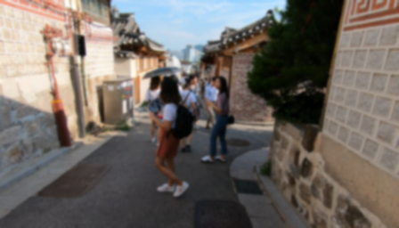
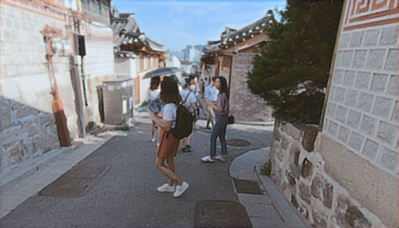

# Image Deblurring using Kernel Filters

This project aims to deblur images generated from kernel filters using deep learning techniques. The goal is to improve the visual quality of blurred images and enhance their clarity.

In this project, we aim to deblur images using kernel filters with varying sizes and sigmas. We apply kernels of (3x3, sigma=0.6), (7x7, sigma=1), and (11x11, sigma=0.16) to generate the blur and sharp test data used for model training.

Link for [Input data](https://drive.google.com/file/d/1SgLnl8FwMgSdY9s_LXjPcmzeY5S0aklK/view?usp=sharing) on which we apply filter to prepare data for input.
Link for [folder](https://drive.google.com/file/d/1Ch1K4yEVUvcX1kZ1JK3GpXXRPyeCe6rf/view?usp=sharing) that contain blur and corresponding sharp image for testing purpose.
## Overview

Blurring in images can occur due to various reasons such as motion blur, out-of-focus blur, or intentional application of blurring filters. Image deblurring involves the process of recovering the original sharp image from its blurred version.

In this project, we focus on deblurring images that have been generated from kernel filters. We use deep learning models, particularly Generative Adversarial Networks (GANs), to learn the mapping between the blurred and sharp images.
## Model Architecture
The Model is a convolutional neural network (CNN) architecture specifically designed for image deblurring tasks. It comprises an **encoder-decoder** structure, which consists of the following components: 
### Encoder
The encoder module consists of several convolutional layers, each followed by batch normalization and Rectified Linear Unit (ReLU) activation functions. This part of the network gradually increases the number of channels while reducing spatial dimensions.

### Decoder
The decoder module mirrors the architecture of the encoder, but with transposed convolutional layers to upsample the feature maps back to the original size. This part of the network also includes batch normalization and ReLU activation functions.

## PSNR Score

Peak Signal-to-Noise Ratio (PSNR) is a commonly used metric to evaluate the quality of reconstructed images. A higher PSNR value indicates better image quality. In this project, we achieved a PSNR score of **19**, indicating significant improvement in image quality after deblurring.

## Getting Started

To get started with the project, follow these steps:

1. Clone the repository: `git clone https://github.com/your_username/image-deblurring.git`
2. Download the raw images from [Input data](https://drive.google.com/file/d/1SgLnl8FwMgSdY9s_LXjPcmzeY5S0aklK/view?usp=sharing) and [Test data](https://drive.google.com/file/d/1Ch1K4yEVUvcX1kZ1JK3GpXXRPyeCe6rf/view?usp=sharing)
3. Prepare your dataset of blurred and sharp images.
4. Train the deep learning model using the provided scripts.
5. Evaluate the model performance using PSNR and other metrics.

## Results

The deblurring model demonstrates impressive performance in enhancing the visual quality of blurred images. Here are some examples of the deblurred images produced by the model:

  
  <figcaption>Blur</figcaption>
  
  <figcaption>Generated</figcaption>
  
  <figcaption>Sharp</figcaption>

## Contributing

Contributions to the project are welcome! If you have any ideas, bug fixes, or feature enhancements, feel free to open an issue or submit a pull request.

## License

This project is licensed under the MIT License - see the [LICENSE](LICENSE) file for details.

## Acknowledgements

We would like to acknowledge the contributions of the open-source community and the authors of the libraries and frameworks used in this project.

